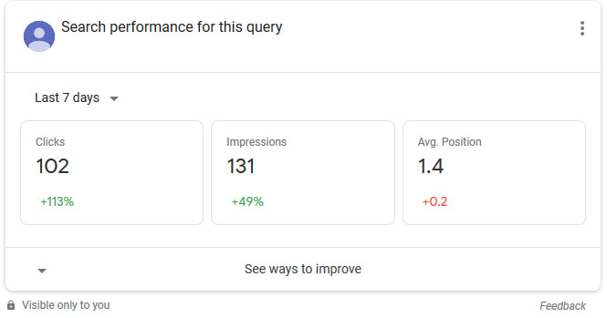

Monitoring our domain performance is a vital action in the SEO best practices steps. You can make your changes to boost the SEO and then use [Google Search Console](https://google.com/webmaster) to recieve acknowledgements about your changes and realize whether you should continue your approach or you need to change the method. 

## Performance  

Performance section on Search console is the first section we check to monitor our SEO functionality. By default, we'll be able to see the statistic for the web type searches in the last three months. However, we are able to change all these defaults to see the report within a specific range and for specific search type such as `web`, `image`, and `video`. Also, there is a possibility to compare the statistic between two different range and evaluate our investigation on SEO best practices.  

This report allows us to monitor the **impressions** and **clicks** within a time range.  

**Clickthrough Rate** (*CTR*) is another factor to take into account when monitoring the report. It shows that how many percent of users who saw our link on the result page and reacted to it by clicking the link and visiting our website.  

More importantly, **average position** informs us about the position of our entry in the search result for all the impression we had. Normally, the lower the average position is, the higher CTR will be. In other words, lower average position shows that our website has been shown in a higher position in the search engine result page (*SERP*). And the fact is, users are clicking the links more likely, when they're shown in a higher position. Generally saying, reducing average position should be one of our goals when working on SEO best practices.

On the performance section, we can monitor our impressions and clicks in details based on various factors. These factors are accessible at the bottom of the page. 

**Queries** tab shows us how many impressions and clicks did we have for each keyword. There is a list of keywords that our website was shown for and we can see how many views and clicks we had for each of them.  

**Pages** tab informs us about the pages of our website which had impressions and clicks. In this tab, we can monitor how many times a specific page has been shown on SERP and how many times users clicked on that entry. Similarly, we can see the same report based on users' **Countries** and **Devices**.  

**Search Appearence** is another tab of this section which gives insight about a different criteria. This section shows the report based on the special result in SERP. For instance, it shows the report about the queries that showed your `AMP Articles`, `Light Pages`, `Featured Content`, and similar factors. Based on the implementation of your website, you may have some records in this section and lack of others. However, this sections shows the report related to the feature content that appear on search result. You may have notices the carousel on top of the search result when you search for a recipe or a movie for instance. Or sometimes you may have seen questions and answers part on the result page related to your query which you can gain information without visitng the site. You can explore your website report for these results if your website is eligible to be shown.  

## Removals  

If you've noticed a dramatically drop in your impression, this section should be the first thing to check. Sometimes people may mistakenly or intentionally add a url in this section which tells Google to not index any of the pages that is pointed by this request.  

In this section, you can ask Google to avoid indexing a specific URL or URLs which are starting with a specific phrase temporarily. This de-indexing is temporary because, Google automatically cancel the rule after 6 months from request time.  

We can submit a new request here to exclude a page or several pages from Google index temporarily and also able to cancel our request. For instance, if we add a request like below:  

    Start with: https://example.com/

It means the whole website will be excluded from Google index and you'll have no impression unless you cancel this request.  

## Search Console in Search Results  

This is the newest feature in Search Console I suppose. If you have an ownership role for the website, you can enable this option which allows you to have an overview about your website performance for a query that list your website on the result page.  

  

## Users and Permissions  

Peridocally explore who has access to your domain's search console by clicking `Settings -> Users and Permissions`. There are possibilites that you don't give access directly to someone, but still he manage to find a way to access to search console. For instance, one can gain access to search console with having access to Google Analytics panel.  

Using this section, you have an overview about who has access to the panel and who are those who responsible for changes and errors on search console.  

## Real-Time Report  

Search Console itself says that it almost update the result every four hours but that doesn't mean the update is related to last 4 hours  :neutral_face:.  

*What am I talking abut?*  

Simply, I'm saying do not rely on the Search Console Report for the current day or even be careful about the day before. Normally, I rely on the result for more than 24 hours ago. Because, I noticed changes in the report of recent traffic while I was analyzing the result.