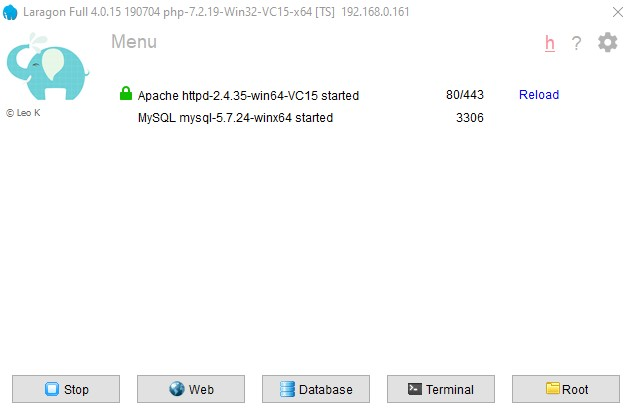
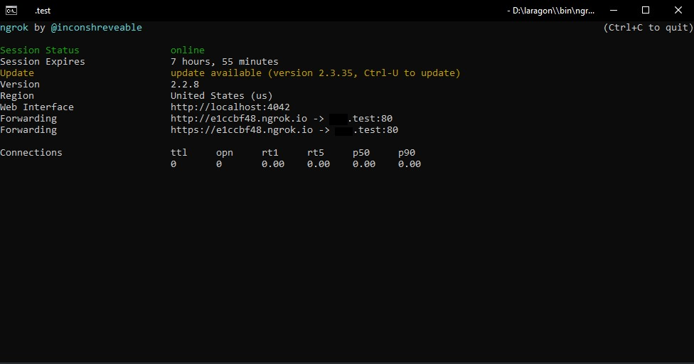

## TL;DR  

Why should you move to Laragon?  
  - Having 64-bit development environment and access to up to  :speak_no_evil: of RAM.  
  - Creating customized URL for your local project automatically.  
  - Enable your local project to be accessible to world for testing purposes.  
  - Integrate any type of MySQL interface easily.  
  - Enable self-signed SSL certificate for your local project with a single click.  
  - Manage multiple versions of PHP with no hassle.  
  - And many more features which I haven't used yet.

I was desperate after trying to run PHP on my windows machine in 64-bit mode. I had a local project and due to some reasons, I needed more than 4 GB of RAM and 32 bit application was not able to provide it.  

Finally, I came across [Laragon](https://laragon.org/) which provides 32-bit and 64-bit version.  

*I know, I know. [Apache Friends](https://www.apachefriends.org/blog/new_xampp_20190227.html) announced that they release 64-bit version of XAMPP. But it's late. I already found my local mate :sunglasses:.*  

Setting up your local project was nevery this easy. Actually, you don't need to do anything unless you want to add more functionality. Let's explore some of its features together. So for now, I have no intention to go back and use XAMPP again and also, no intention to use docker for such purposes as it increases complexity and does not make any sense.  

**You on board? Get on, we're going...**  



## 1. Laragon Basics  

When you install Laragon, it creates its directories within the pass that you defined and it prepares a folder called `www` for you to create your projects and access to them. So, create a folder called `sample` in this path and add a `index.php` file with the following code:  

```php
<?php echo phpinfo(); ?>
```

Now open `localhost/sample` in your browser and there you go. Your first giant PHP application using Laragon. Now open `http://sample.test`. *TADA...*  

There is no need for you to alter Windows and apache `hosts` files to have customized URL to your local application. Laragon do it for you when you create a project in `www` folder. However, remember that Laragon checks for new projects, when you start services. So, if it is already started, you need to restart services to have access to `.test` URL.  

You want to change the project folders from `www` or you want to change the format of customized URL from `PROJECT_NAME.test`? Just open settings by clicking gear icon and configure what you want in `General` tab.  

## 2. What Services are Provided by Laragon?  

By default, when you start services in the main page, Apache, PostgreSQL, and MongoDB will be started and you can use them using their default port defined by Laragon.  

However, you are able to integrate Nginx, Memcached, and Redis with single click. Also, what I love about Laragon is the flexibility that you can configure almost everything.  

If you want to add another service to be started on start-up or change services' ports, just go to settings and `Servises & Ports` tab.  

## 3. Make Your Local Project Publicly Accessible (Sharing Feature)  

And now the coolest feature. Laragon is using [Ngrok](https://ngrok.com/) to allow you to share your local project and able to access it with a URL address like `[Hash_Key].ngrok.io`. Based on the direct quote:  

>ngrok exposes local servers behind NATs and firewalls to the public internet over secure tunnels.  

In Laragon, you can share any project under `www` folder by clicking on the `Menu -> www -> share -> [Project_Name]`. After clicking on share, a CMD window will be opened and the `ngrok.io` specific URL will be copied into your clipboard. Also, a notification will pop up which shows that a URL will point to your local `.test:` URL on port 80.  



That's all. Now you can give that URL to your friend to check out your local changes or you can open the URL in your mobile device for an actual testing purposes.

## 4. MySQL Databases Interface  

Laragon shipped with HeidiSQL by default. But, if you're into PHPMyAdmin, you just need to download it and extract it under `etc/apps/phpMyAdmin` folder. Then you can access it simply with `localhost/phpmyadmin`.  

## 5. Multi-Version  

You want to have more than one PHP or MySQL version? You can have any number of versions you want by installing that version yourself in `bin/` folder. Every app or service here has a folder, such as `php`, `apache`, `mysql`, `nginx`, and so on. This structure enables you to have multi-version of every apps and services in Laragon.  

Keep in mind that everything has been implemented in Laragon based on simplicity. Now, it's time for Hossein's aphorism:  

>There is always an easy way to accomplish something. Don't make things complicated, while there is a simple way and there always is one.