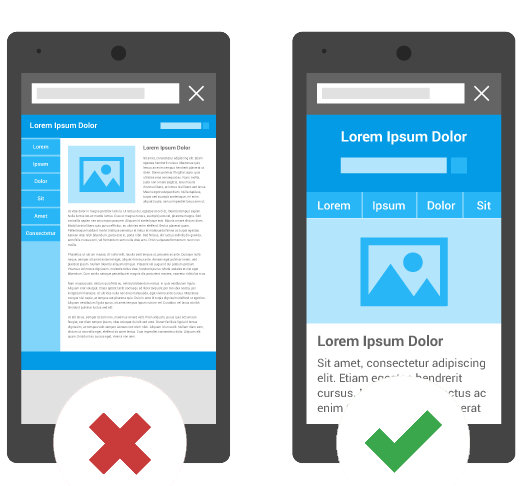

I was working on a website and was responsible to increase the organic users and implement SEO best practices. I was able to increase organic traffic by implementing some structural changes but the result was not promising. Therefore, I had a chance to search for some tools in order to help me gain more information about how we are doing in the manner of kewords, our positions on search engine result page (*SERP*), and studing our competitors.  

At first, we had a subscription to use [SpyFu](https://spyfu.com/) for fetching insights about the mentioned concerns. After working with their platform, I was kind of disappointed and started to llok for other similar services where I confronted [SEMRush](https://semrush.com/) and what a delightful discovery!  

While I was monitoring SpyFu report I realized some inaccuracy compared to Google Search Console and when I contacted them about the matter, the response was undeterministic. In other words, they said that the report I see is all they can provide based on the data they collect. So that was very frank and helped me to cancel subscription without second thoughts.  

Then, I started using SEMRush free version which allows you to execute 10 queries per day. It was a headache that I was limited but I didn't want to inform our team about the change until I'm 100% sure. However, you can use their 7 days free trial version to bypass the headache step  :neutral_face:. *I really do have excuses why I didn't use their trial version. So, we're all agree that I'm not stupid.*  

I said all that to illuminate that the following findings are based on the investigation I had using their platform. And, **NO**. I haven't received any payments from them to write this article, although I will accept if they're willing to :speak_no_evil:.  

So, **How should we increase our organic traffic?**  

## Mobile Traffic Vs. Desktop Traffic
Due to [Web Traffic Geeks](https://webtrafficgeeks.org/desktop-vs-mobile-traffic-the-ultimate-guide/) and many other researches, out of all organic searches, almost 80% of organic traffic belong to mobile users. That's a huge share indeed and we will lose the battle if we do not consider it.  

From another perspective, due to Google, [Mobile-First Indexing](https://developers.google.com/search/mobile-sites/mobile-first-indexing) has become the default crawler for all websites from July 1st, 2019. So, if you don't have mobile-specific webpages, such as a responsive design, please go and implement it as the rest of this article won't be useful to you unless you have the basic structure for your mobile users.  

  

Mobile-first crawler means that Google looks for mobile friendliness of your website. Have you implemented respective meta tags? Is the content readable? Are the buttons easy to click on small devices? and many more factors.

Now that we understand the importance of mobile users and that Google is indexing your website using their mobile-first crawler, we have to optimize our website for mobile devices.  

## Content Visibility  

The first thing to keep in mind is not to hide content from mobile users because of smaller space. In other words, if you hide your sidebar completely from mobile users, Google crawler will not be able to read those content and therefore unable to index links that are present in your sidebar.  

Similarly, you may have a content that might help you to get indexed for some keywords. If you hide that content, you may lose a chance to index those keywords.  

If you want to have separate design for a specific section, that's cool. But, it should not lead to hiding important information from specific device's users.  

## Long-tail Vs. Short-tail Keywords  

We have always heard that if you want to start investing on keywords, it's better to begin with long-tail keywords.  

The idea behind this approach is long-tail keywords are more specific which means fewer users are searching for them. But it may lead to more conversion as the user exactly knows what he's looking for. From another perspective, it is way more complicated to be indexed for short-tail keywords as the competition is high.  

But another factor which came up with the mobile-first crawler is mobile users behavior. Users on mobile device tend to write shorter queries compared to desktop users. This is also the same for voice searches. It means that if we optimize for mobile device, we'll have better result for voice searches as well.  

Therefore, keep in mind that beside implementing long-tail keywords, you should also focus on short-tail keywords as well. This will give you a chance to focus on not only 20%, but 100% of organic users. In other words, being indexed for a short-tail keyword may give you organic users four times more than a long-tail one.  

>Always consider optimizing your website for mobile users while designing, developing, and researching keywords. God may give you more organic user if you believe and Search Engines if you don't.  

## How SEMRush can Help?  

Aside from several features that SEMRush provides, you can do keyword research. By starting from a keyword that you think is good, you can find similar keywords for mobile and desktop. As we mentioned earlier, optimizing for mobile keywords are totally different from desktop keywords and SEMRush knows it.   

They allow you to see the similar keyword to your primary keyword in desktop and mobile. So you'll have a bunch of long-tail keywords for desktop and a bunch of their shorter version for mobile users.  

You can use their free version which let you perform 10 daily actions but you should be careful to not waste it. However, apart from SEMRush, do not limit yourself to just one tool. Try to run audit on your website using several tools available out there such as [Woorank](https://www.woorank.com/) and [Moz](https://moz.com/). They also provide free version which is enough to get you started. So, do not hesitate to use them all and gain specific insight from each of them.  

>SEO is a never-ending task that requires your patience and continouse research. Do not stop and take the most out of all available tools out there but do not waste your time on useless platforms.